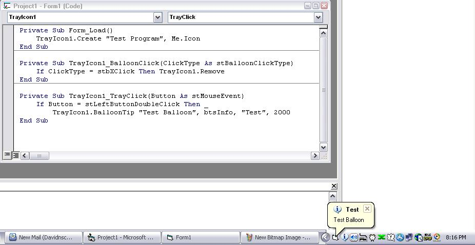



## Tray Icon with Balloon Tips \(UserControl\)

### Description

This code makes it incredibly easy (one line to add one) to add system notification icons (aka tray icons) to your program! You can even call up Balloon Tips on compatible OSes (XP and 2000, I believe). Functions are structured to be as close to their VB counterparts as possible (BalloonTip is structured like MsgBox for example)
 
### More Info
 
Read the ReadMe.txt file for in-depth instructions, but basically, the Create function adds the tray icon, the Delete function removes it, and the events notify you if the user has clicked on the tray or balloon tip, and how.

While it's better coding to manually call the remove function to remove the tray before you end your program, the usercontrol DOES automatically remove it if you unload the form correctly.

             |
---                |---
**Submitted On**   |2004-04-18 15:18:14
**By**             |[David Schneider](https://github.com/Planet-Source-Code/PSCIndex/blob/master/ByAuthor/david-schneider.md)
**Level**          |Intermediate
**User Rating**    |4.8 (19 globes from 4 users)
**Compatibility**  |VB 6\.0
**Category**       |[Custom Controls/ Forms/  Menus](https://github.com/Planet-Source-Code/PSCIndex/blob/master/ByCategory/custom-controls-forms-menus__1-4.md)
**World**          |[Visual Basic](https://github.com/Planet-Source-Code/PSCIndex/blob/master/ByWorld/visual-basic.md)
**Archive File**   |[Tray\_Icon\_1734864182004\.zip](https://github.com/Planet-Source-Code/david-schneider-tray-icon-with-balloon-tips-usercontrol__1-53239/archive/master.zip)

